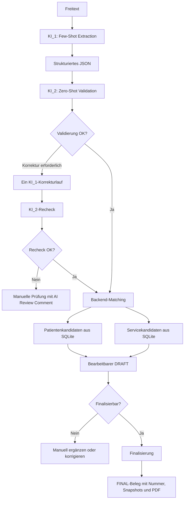
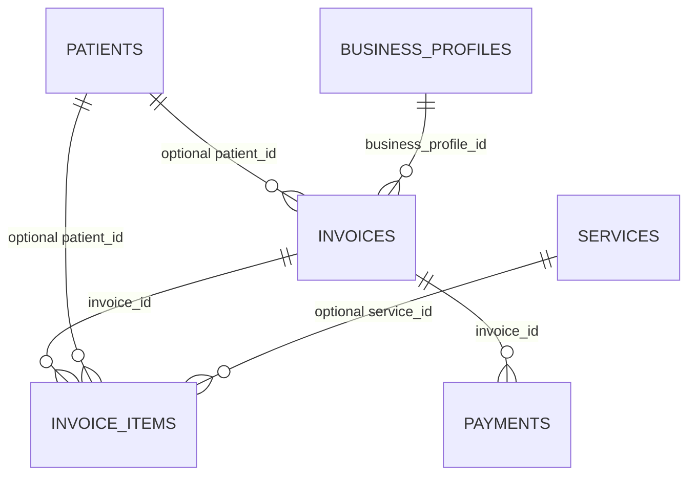

# KI-Rechnungsassistent für Podologie

Der KI-Rechnungsassistent ist eine lokale Webanwendung zur Vorbereitung, Prüfung und Verwaltung von Rechnungsdaten einer podologischen Praxis. Ziel ist es, wiederkehrende Verwaltungsarbeit zu reduzieren, ohne abrechnungsrelevante Entscheidungen an ein Sprachmodell abzugeben.

Freitext-Eingaben werden strukturiert und anschließend mit realen Patienten, Leistungen und Preisen aus der lokalen Datenbank abgeglichen. Die KI darf dabei keine Preise, Steuern, Summen, Rechnungsnummern, Datenbank-IDs oder neue Leistungen erfinden. Abrechnungsrelevante Werte stammen ausschließlich aus SQLite; Geldbeträge werden mit `Decimal` im Backend berechnet.

Rechnungen entstehen zunächst als bearbeitbare `DRAFT`s. Vor der Finalisierung müssen Patient, Leistungen/Produkte und KI-Prüfhinweise geklärt sein. Erst die Finalisierung vergibt eine dauerhafte Belegnummer und sperrt den Beleg gegen normale Änderungen.

Das Backend ist bereits weit entwickelt. Ein benutzerfreundliches Web-Frontend ist noch nicht umgesetzt und gehört zu den nächsten großen Entwicklungsschritten.

## Projektstatus

| Bereich | Status | Beschreibung |
| --- | --- | --- |
| FastAPI-Backend | ✅ umgesetzt | REST-API mit OpenAPI-/Swagger-Dokumentation unter `/docs`. |
| SQLite und SQLAlchemy | ✅ umgesetzt | Lokale SQLite-Datenbank, SQLAlchemy-Modelle und auf PostgreSQL übertragbare Modellierung. |
| Pydantic-Validierung | ✅ umgesetzt | Strenge Request-Schemas; unbekannte Felder werden abgewiesen. |
| Patientenverwaltung | ✅ umgesetzt | CRUD, Suche, Aktivieren/Deaktivieren, kontrolliertes Hard Delete und Rechnungsübersicht je Patient. |
| Leistungen und Produkte | ✅ umgesetzt | CRUD, aktive/inaktive Services sowie Preise und Steuersätze als Stammdatenquelle. |
| Business Profiles | ✅ umgesetzt | CRUD, stabile Rechnungspräfixe und dauerhafte Präfix-Reservierungen. |
| Rechnungen und Positionen | ✅ umgesetzt | DRAFT-CRUD, Positionsverwaltung, serverseitige Snapshots und Summenberechnung. |
| Arbeitsliste / Vorschau | ✅ umgesetzt | `GET /invoices?status=DRAFT` liefert mehrere Entwürfe; Einzelabruf enthält die Positionen. |
| Finalisierung | ✅ umgesetzt | Validierung, Snapshot-Prüfung, Nummernvergabe, Transaktion und FINAL-Schreibschutz. |
| Rechnungsnummern | ✅ umgesetzt | Nummern erst bei FINAL, getrennt nach Business Profile, Dokumenttyp und Jahr. |
| Prefix Reservations | ✅ umgesetzt | Ein einmal vergebener `invoice_prefix` bleibt auch nach Hard Delete reserviert. |
| Payments und Teilzahlungen | ✅ umgesetzt | Mehrere Payments pro Rechnung, Decimal-Prüfung, Überzahlungsschutz und abgeleiteter Zahlungsstatus. |
| PDF und GiroCode | ✅ umgesetzt | FINAL-Einzel- und Sammelrechnungen als ReportLab-PDF mit EPC-/GiroCode. |
| Sammelrechnung | ✅ umgesetzt | Gemeinsamer Beleg mit mehreren Patienten über `COLLECTIVE_INVOICE`; mehrseitige Tabellen werden unterstützt. |
| Quittung | ◐ teilweise umgesetzt | Dokumenttyp `RECEIPT` und eigener Nummerncode `QT` sind vorhanden; ein eigenständiger Zahlungs-/Quittungsworkflow und ein spezielles Quittungslayout sind noch offen. |
| OpenAI-Integration | ✅ umgesetzt | OpenAI Responses API, API-Key über `.env`, strukturierte JSON-Verarbeitung und Fehlerbehandlung. |
| KI_1 Extraktion | ✅ umgesetzt | `gpt-4.1-mini` strukturiert Freitext mit Few-Shot Prompting. |
| KI_2 Validierung | ✅ umgesetzt | `gpt-4o-mini` prüft die KI_1-Ausgabe unabhängig per Zero-Shot Prompting. |
| KI-Orchestrierung | ✅ umgesetzt | Maximal ein KI_1-Korrekturlauf mit anschließender KI_2-Nachprüfung; danach manuelle Prüfung. |
| Dynamic Context Injection | ✅ umgesetzt | Pro Request werden ausschließlich aktive Service-Bezeichnungen aus SQLite an KI_1 und KI_2 übergeben. |
| Patienten- und Service-Matching | ✅ umgesetzt | Kandidatenauflösung, aktive Datensätze bevorzugt, Heim-Kontext, Ambiguitäten und ungeklärte Positionen. |
| Varianten-/Größenschutz | ✅ umgesetzt | Explizite Größen wie `100 ml` werden nicht auf einen abweichenden aktiven `40 ml`-Service normalisiert. |
| KI-Prüfhinweise | ✅ umgesetzt | Originaltext, ungeklärte Punkte und `ai_review_comment` können am DRAFT gespeichert werden. |
| pytest und Regressionstests | ✅ umgesetzt | Unit- und API-Tests für Stammdaten, Rechnungen, Payments, PDFs, GiroCode, KI, Matching und Finalisierung. |
| Monitoring | ◐ teilweise umgesetzt | KI-Stufen und Modellnamen werden geloggt; Input-/Output-Token werden erfasst. Kosten- und Latenzmessung fehlen noch. |
| Web-Frontend | ⬜ offen | Derzeit steht die API inklusive Swagger UI im Vordergrund. |
| Zweite Text-Generation-API | ⬜ offen | Bisher wird nur die OpenAI API verwendet. |
| Comparative Analysis | ⬜ offen | Vergleich mit einer zweiten API und systematische Auswertung stehen noch aus. |
| Heimtag / Mehrfacheingabe | ⬜ offen | Noch kein eigener Workflow für die gebündelte Erfassung mehrerer Behandlungen. |
| Projektvideo und Präsentation | ⬜ offen | Gehören zur Abschlussphase. |

## Project Minimum Requirements

| Requirement | Umsetzung | Status |
| --- | --- | --- |
| Flask oder FastAPI API | FastAPI mit REST-Endpunkten und Swagger UI | ✅ |
| SQLite oder PostgreSQL | SQLite im MVP, SQLAlchemy als ORM | ✅ |
| Use-case specific | Rechnungsassistent für eine podologische Praxis | ✅ |
| 2 Prompt Engineering Techniques | KI_1 Few-Shot Extraction und KI_2 Zero-Shot Validation | ✅ |
| Advanced technique | Dynamic Context Injection mit aktiven Services aus SQLite | ✅ |
| Text Generation API 1 | OpenAI Responses API | ✅ |
| Text Generation API 2 | Noch nicht integriert | ⬜ |
| Comparative Analysis | Nach Integration der zweiten API durchzuführen | ⬜ |

> Zwei unterschiedliche OpenAI-Modelle sind **keine** zwei verschiedenen Text-Generation-APIs. Die zweite API und die Vergleichsanalyse bleiben daher offen.

## Architektur



### KI-Pipeline und fachliche Grenzen

1. **KI_1** verarbeitet den Originaltext mit Few-Shot Prompting und liefert strukturiertes JSON. Sie erkennt unter anderem Patientendaten, Heim-Kontext, Positionen, Mengen, Dokumentart und ausdrücklich genannte Zahlungsinformationen.
2. **Dynamic Context Injection** liest pro Request die Namen aller aktiven Services aus SQLite. Nur Namen werden übermittelt — keine Preise, Steuern, IDs oder kompletten Patientendaten. Bei eindeutiger leichter Abweichung darf KI_1 auf die offizielle aktive Bezeichnung normalisieren. Explizite Varianten, etwa `100 ml` gegenüber `40 ml`, dürfen nicht verändert werden.
3. **KI_2** vergleicht Originaltext und KI_1-JSON per Zero-Shot Validation. Sie ist kein zweiter Extraktor und trifft keine Abrechnungs-, Preis-, Steuer- oder Datenbankentscheidungen.
4. Wenn KI_2 konkrete Fehler meldet, erhält KI_1 genau **einen** Korrekturversuch mit Originaltext, bisherigem JSON und den Issues. KI_2 prüft anschließend den vollständigen korrigierten Datensatz erneut. Bestehen danach weiterhin Probleme, wird kein weiterer automatischer Lauf gestartet; der Vorgang erhält einen Prüfhinweis.
5. Das Backend löst danach Patienten- und Servicekandidaten gegen SQLite auf. Preise, Steuersätze, IDs und Snapshots werden ausschließlich aus den Stammdaten übernommen.

| Stufe | Standardmodell | Aufgabe |
| --- | --- | --- |
| KI_1 | `gpt-4.1-mini` | Few-Shot Extraktion und ein möglicher Korrekturlauf |
| KI_2 | `gpt-4o-mini` | Zero-Shot Validierung und möglicher Recheck |

### Matching und KI-DRAFTs

- Ein aktiver Patient wird nur bei eindeutiger passender Suche automatisch zugeordnet. Vollname, Teilname und optionaler Heim-Kontext werden berücksichtigt.
- Mehrere Treffer, ausschließlich inaktive Treffer oder verstorbene Patienten werden als Kandidaten zurückgegeben, aber nicht automatisch zugeordnet.
- Kein Treffer führt zu `new_patient`: Die aus dem Text extrahierten Daten bleiben nur temporär am DRAFT. Ein neuer Patient wird erst innerhalb der FINAL-Transaktion angelegt.
- Services werden ausschließlich gegen aktive Stammdaten aufgelöst. Nicht gefundene oder mehrdeutige Services werden als `unresolved_items` am DRAFT gespeichert und nicht als falsche Rechnungsposition angelegt.
- Ein KI-DRAFT bleibt über die normalen Invoice-Endpunkte bearbeitbar. Er wird nur finalisierbar, wenn Patient, Items und KI-Prüfstatus geklärt sind.

## Technischer Stack

- Python
- FastAPI und Uvicorn
- SQLAlchemy
- SQLite im MVP
- Pydantic und pydantic-settings
- OpenAI Python SDK / Responses API
- ReportLab für PDFs
- qrcode für EPC-/GiroCode
- pytest, httpx und pypdf für Tests

## Lokaler Start

### Voraussetzungen

- Python mit lokaler virtueller Umgebung (`.venv`)
- Für KI-Endpunkte ein OpenAI API-Key

```powershell
.\.venv\Scripts\Activate.ps1
pip install -e ".[dev]"
uvicorn app.main:app --reload
```

Danach stehen unter anderem diese URLs bereit:

- Swagger UI: <http://127.0.0.1:8000/docs>
- Healthcheck: <http://127.0.0.1:8000/health>

Die Konfiguration wird aus `.env` gelesen. Ausgangspunkt ist `.env.example`:

```env
DATABASE_URL=sqlite:///./data/app.db
APP_NAME=KI Rechnungsassistent für Podologie
OPENAI_API_KEY=
OPENAI_KI1_MODEL=gpt-4.1-mini
OPENAI_KI2_MODEL=gpt-4o-mini
```

`.env`, lokale Datenbanken in `data/` und erzeugte PDFs in `generated/` sind nicht für Git bestimmt.

## API

Alle Request- und Response-Modelle sind in Swagger unter `/docs` dokumentiert. Die folgende Liste beschreibt die tatsächlich registrierten Anwendungsrouten.

### System

| Methode | Pfad | Zweck |
| --- | --- | --- |
| `GET` | `/` | Basisantwort der Anwendung. |
| `GET` | `/health` | Einfacher Healthcheck (`{"status": "ok"}`). |
| `GET` | `/openapi.json` | Automatisch erzeugte OpenAPI-Beschreibung. |
| `GET` | `/docs` | Interaktive Swagger UI. |
| `GET` | `/redoc` | Alternative ReDoc-Dokumentation. |

### Patienten

| Methode | Pfad | Zweck |
| --- | --- | --- |
| `POST` | `/patients` | Patient anlegen; `patient_nr` ist eindeutig. |
| `GET` | `/patients` | Patienten auflisten; optional `search` und `include_inactive`. |
| `GET` | `/patients/{patient_id}` | Patient laden. |
| `PATCH` | `/patients/{patient_id}` | Patient ändern; `updated_at` wird serverseitig aktualisiert. |
| `POST` | `/patients/{patient_id}/deactivate` | Soft Delete (`active=false`). |
| `POST` | `/patients/{patient_id}/activate` | Wieder aktivieren; bei `deceased=true` gesperrt. |
| `DELETE` | `/patients/{patient_id}?confirm=true` | Kontrolliertes Hard Delete, nur ohne geschützte Abhängigkeiten. |
| `GET` | `/patients/{patient_id}/invoices` | Eindeutige Rechnungsübersicht des Patienten über seine InvoiceItems. |

### Leistungen und Produkte

| Methode | Pfad | Zweck |
| --- | --- | --- |
| `POST` | `/services` | Leistung oder Produkt anlegen. |
| `GET` | `/services` | Leistungen auflisten; optional Suche und `include_inactive`. |
| `GET` | `/services/{service_id}` | Leistung laden. |
| `PATCH` | `/services/{service_id}` | Leistung ändern. |
| `POST` | `/services/{service_id}/deactivate` | Soft Delete. |
| `POST` | `/services/{service_id}/activate` | Wiederherstellen. |
| `DELETE` | `/services/{service_id}?confirm=true` | Kontrolliertes Hard Delete, nur ohne historische Verwendung. |

### Business Profiles

| Methode | Pfad | Zweck |
| --- | --- | --- |
| `POST` | `/business-profiles` | Firmen-/Praxisprofil anlegen; `invoice_prefix` wird ausschließlich serverseitig vergeben. |
| `GET` | `/business-profiles` | Profile auflisten; optional Suche und `include_inactive`. |
| `GET` | `/business-profiles/{business_profile_id}` | Profil laden. |
| `PATCH` | `/business-profiles/{business_profile_id}` | Stammdaten ändern, ohne `invoice_prefix` zu ändern. |
| `POST` | `/business-profiles/{business_profile_id}/deactivate` | Soft Delete. |
| `POST` | `/business-profiles/{business_profile_id}/activate` | Wiederherstellen. |
| `DELETE` | `/business-profiles/{business_profile_id}?confirm=true` | Kontrolliertes Hard Delete ohne abhängige historische Daten; Präfixreservierung bleibt bestehen. |

### Rechnungen und Positionen

| Methode | Pfad | Zweck |
| --- | --- | --- |
| `POST` | `/invoices` | Manuellen DRAFT anlegen; noch ohne Belegnummer. |
| `GET` | `/invoices` | Rechnungen bzw. Arbeitsliste laden; optionaler Filter `status`, z. B. `DRAFT`. |
| `GET` | `/invoices/{invoice_id}` | Rechnungs-Vorschau inklusive Positionen, Summen und Zahlungsstatus laden. |
| `PATCH` | `/invoices/{invoice_id}` | Rechnungsdaten eines DRAFT ändern. |
| `POST` | `/invoices/{invoice_id}/items` | Position zu einem DRAFT hinzufügen; Service- und Patientensnapshots werden serverseitig gesetzt. |
| `GET` | `/invoices/{invoice_id}/items` | Positionen eines Belegs laden. |
| `PATCH` | `/invoices/{invoice_id}/items/{item_id}` | Menge, Patient oder Service einer DRAFT-Position ändern. |
| `DELETE` | `/invoices/{invoice_id}/items/{item_id}` | DRAFT-Position löschen. |
| `POST` | `/invoices/{invoice_id}/finalize` | DRAFT prüfen, ggf. temporären neuen Patienten anlegen, Nummer vergeben und FINAL setzen. |
| `GET` | `/invoices/{invoice_id}/pdf` | PDF eines vollständig finalisierten Belegs erzeugen und ausliefern. |

Normale Änderungen an Rechnungen und Positionen sind ausschließlich im Status `DRAFT` erlaubt. Ein FINAL-Beleg bleibt über `GET` lesbar, ist aber über die Änderungsendpunkte geschützt.

### Zahlungen und Teilzahlungen

| Methode | Pfad | Zweck |
| --- | --- | --- |
| `POST` | `/payments` | Zahlung mit `invoice_id`, Betrag, Datum, Zahlungsart und optionaler Notiz anlegen. |
| `GET` | `/payments/{payment_id}` | Einzelne Zahlung laden. |
| `PATCH` | `/payments/{payment_id}` | Zahlung ändern; Überzahlung bleibt verhindert. |
| `DELETE` | `/payments/{payment_id}` | Zahlung im MVP löschen. |
| `GET` | `/invoices/{invoice_id}/payments` | Zahlungen einer Rechnung chronologisch laden. |

Erlaubte Zahlungsarten sind `CASH` und `BANK_TRANSFER`. Mehrere Payments pro Rechnung bilden Teilzahlungen ab. `paid_amount`, `remaining_amount` sowie `OPEN`, `PARTIALLY_PAID` und `PAID` werden aus den vorhandenen Payments abgeleitet und nicht redundant gespeichert.

### KI

| Methode | Pfad | Zweck |
| --- | --- | --- |
| `POST` | `/ai/extract` | Nur KI_1-Extraktion mit aktivem Service-Kontext. |
| `POST` | `/ai/validate` | KI_2 direkt gegen vorgegebenen Originaltext und vorhandenes KI_1-JSON ausführen; kein KI_1-Aufruf, keine Persistenz. |
| `POST` | `/ai/extract-and-validate` | KI_1 → KI_2 → optional ein Korrekturlauf → KI_2-Recheck; optional kann das Ergebnis an einem bestehenden DRAFT gespeichert werden. |
| `POST` | `/ai/extract-and-create-draft` | Validierten einzelnen KI-Fall matchen und als normalen, bearbeitbaren DRAFT anlegen. |

`/ai/extract-and-create-draft` erstellt nur dann InvoiceItems für eindeutig aufgelöste aktive Services. Ungeklärte Patienten oder Services bleiben als strukturierte Hinweise am DRAFT, damit sie vor der Finalisierung manuell geklärt werden können.

## Rechnungs- und Finalisierungsworkflow

1. Ein Business Profile besitzt einen stabilen, eindeutigen `invoice_prefix`.
2. Ein DRAFT erhält keine Rechnungsnummer und kann manuell oder aus einem KI-Ergebnis erstellt werden.
3. Beim Hinzufügen einer Position werden offizieller Service-Name, Preis, Steuersatz und — falls vorhanden — Patientendaten als Snapshot gespeichert. Summen werden deterministisch mit `Decimal` neu berechnet.
4. FINAL ist nur bei vollständigen Voraussetzungen möglich: mindestens eine Position, gültiges aktives Business Profile, notwendige Daten und keine ungelösten KI-/Matching-Hinweise.
5. Ein temporärer `new_patient` wird erst innerhalb derselben Datenbanktransaktion wie die Finalisierung als Patient gespeichert. Schlägt die Finalisierung fehl, wird auch die Patientanlage zurückgerollt.
6. Erst danach entsteht die globale, eindeutige Belegnummer. Die Nummernkreise sind je Business Profile, Dokumenttyp und Jahr getrennt:

   - Einzelrechnung: `EU-RE-2026-000001`
   - Sammelrechnung: `EU-SR-2026-000001`
   - Quittung: `EU-QT-2026-000001`

7. FINAL-Belege erhalten keine normalen Änderungen mehr. Bestehende Snapshots und Rechnungsnummern werden nicht rückwirkend angepasst.

## PDF und GiroCode

Für FINAL-Einzel- und Sammelrechnungen erzeugt `GET /invoices/{invoice_id}/pdf` ein A4-PDF im lokalen Ordner `generated/invoices/`.

- Die Daten stammen aus dem gespeicherten FINAL-Beleg, seinen Positionen und dem zugeordneten Business Profile.
- Sammelrechnungen zeigen den Patienten direkt in der Positionstabelle und unterstützen mehrseitige Tabellen mit wiederholtem Tabellenkopf und Seitenkopf.
- Zahlungsinformationen enthalten bei gültiger IBAN und positivem Betrag einen EPC-/GiroCode für SEPA Credit Transfer. Der Verwendungszweck lautet `Rechnung {invoice_number}`.
- Ein DRAFT kann kein endgültiges Rechnungs-PDF erzeugen.

## Datenbankstruktur

Die Standarddatenbank ist über `DATABASE_URL` konfiguriert und verwendet ohne abweichende Konfiguration:

```text
data/app.db
```

Die aktuelle, für [dbdiagram.io](https://dbdiagram.io) geeignete Dokumentation liegt in [database.dbml](database.dbml).

| Tabelle | Zweck |
| --- | --- |
| `patients` | Patientenstammdaten, optionale Rechnungsadresse, Heim/Zimmer sowie Aktiv-/Sterbestatus. |
| `services` | Aktive und inaktive Leistungen/Produkte inklusive Netto-Preis und MwSt.-Satz. |
| `business_profiles` | Rechnungssteller, Bank- und Steuerdaten, Standortcode und dauerhafter Rechnungspräfix. |
| `invoice_prefix_reservations` | Dauerhafte Reservierung aller jemals vergebenen Rechnungspräfixe. |
| `invoices` | DRAFT-/FINAL-Belegkopf, Summen, KI-Metadaten und temporäre new-patient-Daten. |
| `invoice_items` | Positionen mit Patient-/Service-FKs und unveränderlichen Snapshots. |
| `payments` | Zahlungen zu Rechnungen; mehrere Datensätze erlauben Teilzahlungen. |



`invoice_prefix_reservations` besitzt bewusst keine Foreign-Key-Beziehung zu `business_profiles`: Eine Reservierung muss auch nach einem zulässigen Hard Delete des Profils erhalten bleiben. Name-, Preis- und Steuer-Snapshots in `invoice_items` sind historische Werte, keine separaten Beziehungen.

## Qualität und Tests

Die Tests decken unter anderem strenge API-Validierung und CRUD-Lebenszyklen, DRAFT-Bearbeitung, Snapshots, Summen, FINAL-Schreibschutz, Nummernkreise, Teilzahlungen, PDFs, GiroCode, KI-Pipeline, Dynamic Context, Variantenlogik, Matching und die transaktionale Neuanlage eines Patienten bei FINAL ab.

Ausführung aus dem Projektverzeichnis:

```powershell
.\.venv\Scripts\python.exe -m pytest -q
```

## Offene MVP- und Abschlussarbeiten

- ⬜ Benutzerfreundliches Web-Frontend für Erfassung, Arbeitsliste, DRAFT-Vorschau und manuelle Klärung
- ⬜ Zweite unabhängige Text-Generation-API
- ⬜ Comparative Analysis der APIs und Prompt-Techniken (Korrektheit, Fehler, Laufzeit, Token/Kosten)
- ⬜ Kosten- und Latenzmonitoring
- ⬜ Eigenständiger Workflow und eigenes Layout für Quittungen
- ⬜ Heimtag-/Mehrfacheingabe-Workflow
- ⬜ DATEV-/Steuerexport und weitergehende Buchhaltungslogik
- ⬜ Demo-Daten ausschließlich mit fiktiven Personen
- ⬜ Projektvideo, Präsentation und finale Abgabedokumentation

## Hinweise für die Entwicklung

- Keine echten Patientendaten, API-Schlüssel, lokale SQLite-Dateien oder erzeugten PDFs committen.
- `Base.metadata.create_all()` erstellt fehlende Tabellen, ersetzt aber keine Migration für bestehende SQLite-Schemata.
- Bestehende DRAFTs erhalten keine Endnummer; Rechnungsnummern und Snapshots bleiben nach FINAL unverändert.
- `TASKS.md` ist ein historischer Planungsstand und bildet nicht alle inzwischen implementierten Schritte ab. Diese README und `database.dbml` dokumentieren den aktuellen Codebestand.
